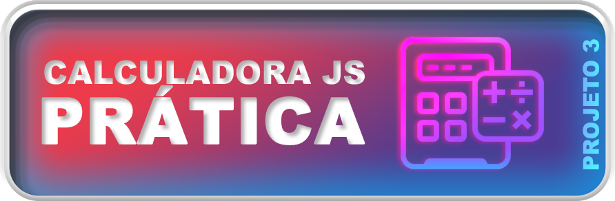

# Calculadora em JavaScript

Este é um repositório contendo o código-fonte para uma calculadora básica em JavaScript. A calculadora foi criada usando HTML, CSS e JavaScript puro.

# Funcionalidades
A calculadora pode realizar operações básicas de adição, subtração, multiplicação e divisão, bem como operações mais complexas, como calcular a raiz quadrada e elevar um número a uma potência específica.

A calculadora também possui um histórico de operações que é atualizado à medida que o usuário realiza cálculos.

# Como usar
Para usar a calculadora, basta clonar este repositório ou baixar os arquivos e abri-los em um navegador da web. Uma vez que a calculadora esteja carregada, você pode clicar nos botões para inserir números e operações. O resultado aparecerá na tela da calculadora.

Veja ela Funcionando aqui: **[Calculadora](https://thankful-plant-0564d7a10.2.azurestaticapps.net/calculadora.html)**

# Personalização
Você pode personalizar a calculadora alterando o arquivo stylecal.css. O arquivo contém estilos para todos os elementos da calculadora, incluindo botões, tela e histórico de operações.

# Contribuição
Se você encontrar um erro ou quiser adicionar uma nova funcionalidade, fique à vontade para abrir uma issue ou enviar uma pull request.

# Licença
Este projeto está licenciado sob a Licença MIT - consulte o arquivo LICENSE.md para obter mais detalhes.
